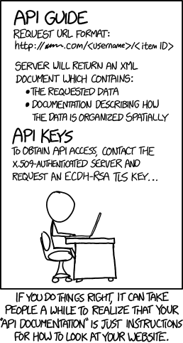

# 0x16. API advanced

---

## Background Context

Questions involving APIs are common for interviews. Sometimes they’re as simple as ‘write a Python script that queries a given endpoint’, sometimes they require you to use recursive functions and format/sort the results.

A great API to use for some practice is the Reddit API. There’s a lot of endpoints available, many that don’t require any form of authentication, and there’s tons of information to be parsed out and presented. Getting comfortable with API calls now can save you some face during technical interviews and even outside of the job market, you might find personal use cases to make your life a little bit easier.

## Resources

**Read or watch:**

- [Redit API Documentation](https://www.reddit.com/dev/api/)
- [Query String](https://en.wikipedia.org/wiki/Query_string)

## Description

This project in the System engineering & DevOps ― Scripting series is about:
* How to read API documentation to find the endpoints you’re looking for
* How to use an API with pagination
* How to parse JSON results from an API
* How to make a recursive API call
* How to sort a dictionary by value

## Files
---
File|Task
---|---
0-subs.py | function that queries the Reddit API and returns the number of subscribers (not active users, total subscribers) for a given subreddit.
1-top_ten.py | function that queries the Reddit API and prints the titles of the first 10 hot posts listed for a given subreddit
2-recurse.py | recursive function that queries the Reddit API and returns a list containing the titles of all hot articles for a given subreddit

## Directories
---
Directory Name | Description
---|---
0x16-api_advanced | main folder with all Python scripts/files

.